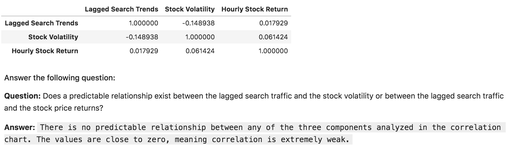
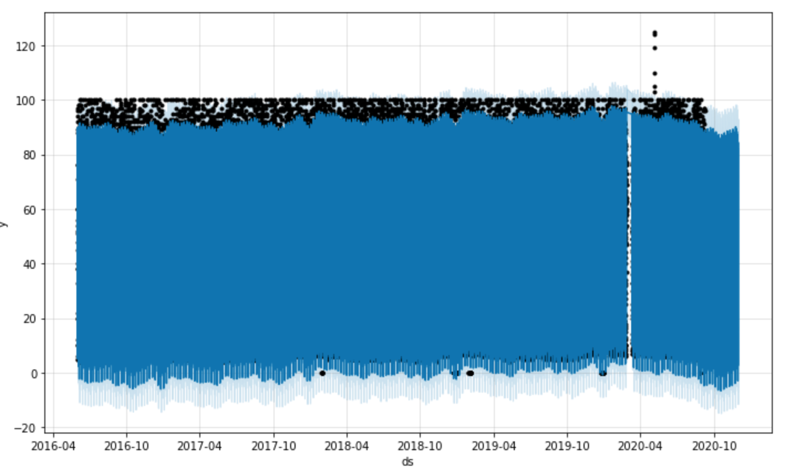
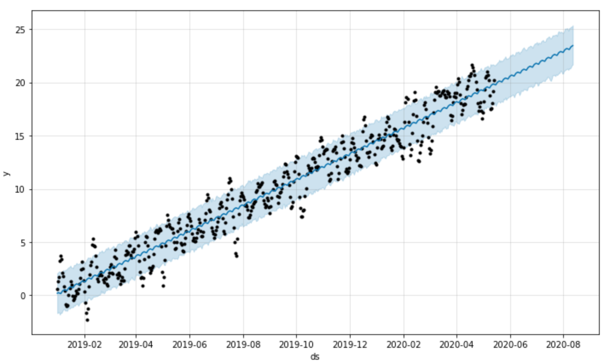

# Forecasting MercadoLibre

`I use Facebook's forecasting tool (Prophet) and MercadoLibre time-series data (search traffic) for analysis. Specifically, I want to find out if the ability to predict search traffic translates into the ability to successfully trade the stock.`

---

## Description

This project performs a time-series analysis on MercadoLibre's search traffic data and closing prices. Search traffic is imported from a CSV that contains search data from Google Trends. First I analyze whether or not there are patterns in the time series data, and whether seasonality has any affect on mercadoLibre's popularity. Next, I used close prices to generate hourly returns and volatility data for the same period as the search traffic data and analyzed whether or not their were any useful correlations. If so, there may be an opportunity to use search traffic to successfully trade MercadoLibre stock. Lastly, I used Facebook's forecasting tool, Prophet, to generate a prediction for both search traffic and quarterly revenues for the company 90 days into the future.

---

## Technologies

This project leverages python 3.7 with the following packages:

* [pandas](https://github.com/pandas-dev/pandas) - For reading data into a DataFrame.

* [hvplot](https://pypi.org/project/hvplot/) - For embedding interactive plots in the application.

* [numpy](https://pypi.org/project/numpy/) - For scientific computing in Python.

* [pystan](https://pypi.org/project/pystan/) - A Python interface to Stan, a platform for statistical modeling and high-performance statistical computation.

* [fbprophet](https://pypi.org/project/fbprophet/) - For automatic time-series forecasting.

---

## Installation Guide

Before running the application first install the following dependencies in a Google Colab file:

```python
  pip install pandas
  pip install hvplot
  pip install fbprophet
  pip install numpy
  pip install datetime
  pip install pystan
```

---

## Usage

To use the Forecasting MercadoLibre application:

1. Locally clone the time_series_forecasting_search_traffic repository from GitHub using the following link:

```python
git clone https://github.com/elliotlozano/time_series_forecasting_search_traffic.git
```

2. Run the [Forecasting MercadoLibre](forecasting_net_prophet.ipynb) program.

3. Examine the plots and review the commentary describing the significance of the results.

---

## Findings

The following visuals help summarize the findings:


`As stated above, the table shows there is very weak correlation between the three factors compared. As such, it is unlikely that you could develop a trading strategy based on search traffic or volatility.`


`The forecasted area of this graph is all the way to the right where there are no black dots. The black dots represent actual data points so beyond that is our predicted trend (seen in blue), which seems to be decreasing slightly over the period.`


`It seems the company's revenue has increased steadily over the years. Using the same forecasting technique, I generated a plot that shows a prediction (past the black dots) for the next quarter revenue. The dark blue line in the middle is the expected revenue, while the light blue channel it's moving through shows the lower and maximum predicted revenues. The expected revenue was projected to be about 970 million dollars for the quarter!`

---

## Contributors

Elliot Lozano

[E-mail](elliotlozano95@gmail.com)

---

## License

MIT


